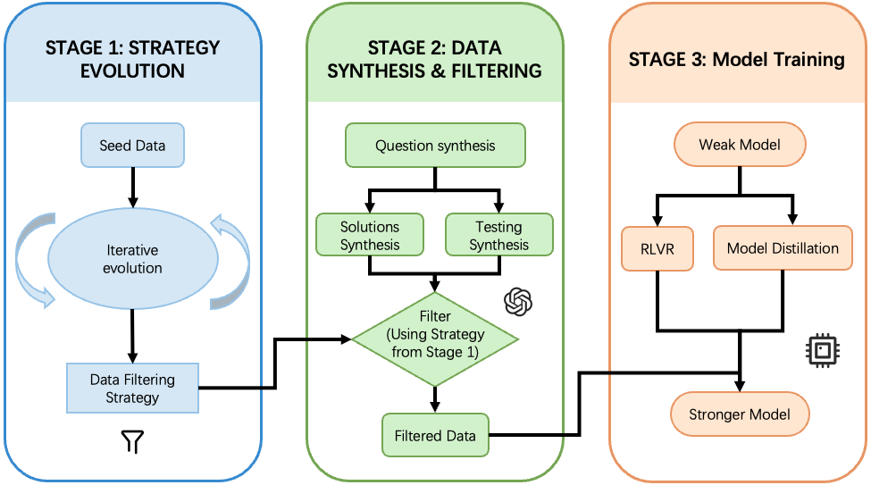

# EvoSyn: Generalizable Evolutionary Data Synthesis for Verifiable Learning

**A task-agnostic, strategy-guided framework that synthesizes verifiable data via evolutionary search.**

[](https://arxiv.org/abs/2510.17928)
[](https://huggingface.co/collections/Elynden/evosyn-68ee4a1b64fe6e5312438e5b)

---

## 📑 Table of Contents

- [TL;DR](#tldr)
- [Overview](#overview)
- [Results](#results)
- [Usage](#usage)

---

## TL;DR

EvoSyn transforms ad hoc filtering into principled, domain-agnostic strategy optimization. Starting from minimal seed supervision, it **evolves a filtering strategy** that jointly guides synthesis of problems, diverse candidate solutions, and verification artifacts—retaining only instances that are reliably verifiable.

**Key advantages:**
- **Generalizable**: Works across executably-checkable tasks (coding, agents) without task-specific rules
- **Reliable**: Enforces agreement between human-annotated checks and strategy-selected checks via two strict consistency criteria
- **Practical**: Produces coherent problems, discriminative tests, and strong solutions suitable for RLVR and distillation

The resulting data drives **consistent gains** for RL with verifiable rewards (RLVR) and distillation across coding and agentic tasks.

---

## Overview

<p align="center">
  
</p>

EvoSyn consists of three core stages:

**Stage 1: Deriving Data Filtering Strategy** — Uses evolutionary algorithms (MAP-Elites + island model) to discover optimal filtering strategies from a small seed set. The strategy is evaluated via a consistency-based evaluator with two strict criteria: (1) Top-ranked solution must pass the human-annotated testing, and (2) Best and worst solutions must behave consistently on both human-annotated test and strategy-selected best test.

**Stage 2: Data Synthesis and Filtering** — For each synthesized problem, generate M candidate solutions and N candidate testings, cross-execute all combinations (M×N executions), rank solutions and tests using the evolved strategy, then apply Zero-Variance Pruning to discard instances with no ranking variation (trivial or unreliable).

**Stage 3: Model Training** — The filtered dataset (problems + discriminative tests + strong solutions) supports reinforcement learning with verifiable rewards (RLVR), model distillation, and other verifiable learning paradigms.

The evolutionary process continuously discovers novel and increasingly powerful strategies. Within 20 iterations, the best strategy surpasses initialization by over 10 percentage points. Data-retention scales with M and N but incurs O(M·N) execution cost. The system discovers diverse, high-quality strategies including TF-IDF-like weighting, coverage-based scoring, inverse filtering, and hardness-aware ranking.

---

## Results

We validate EvoSyn on LiveCodeBench (RLVR training) and AgentBench-OS (model distillation). EvoSyn-filtered data consistently outperforms random selection across all models.

**RLVR on LiveCodeBench:**

<div align="center">

| Model            | Data Setting                 | Dataset Size | Accuracy | Δ vs. baseline |
|------------------|------------------------------|--------------|----------|----------------|
| DeepSeek-V3      | –                            | –            | 36.3     | –              |
| Qwen3-4B         | –                            | –            | 17.0     | –              |
| Llama-3.1-8B     | –                            | –            | 1.6      | –              |
| Qwen3-8B         | –                            | –            | 16.5     | –              |
| Qwen3-4B         | D<sup>EvoSyn</sup>           | 231          | 22.0     | **+5.0**       |
| Qwen3-4B         | D<sup>random</sup>           | 231          | 19.9     | +2.9           |
| Llama-3.1-8B     | D<sup>EvoSyn</sup>           | 231          | 15.7     | **+14.1**      |
| Llama-3.1-8B     | D<sup>random</sup>           | 231          | 11.1     | +9.5           |
| Qwen3-8B         | D<sup>EvoSyn</sup>           | 231          | **24.8** | **+8.3**       |
| Qwen3-8B         | D<sup>random</sup>           | 231          | 21.1     | +4.6           |
| Qwen3-8B         | D<sup>EvoSyn-relaxed</sup>   | 256          | 24.4     | +7.9           |

</div>

EvoSyn outperforms random selection across all models (Qwen3-4B/8B, Llama-3.1-8B) with largest gain of +14.1% on Llama-3.1-8B. Reward curves show faster, steadier growth with EvoSyn-filtered data, indicating higher data quality and training stability.

**Distillation on AgentBench-OS:**

<div align="center">

| Model        | Data Setting      | Accuracy | Δ vs. baseline |
|--------------|-------------------|----------|----------------|
| DeepSeek-R1  | –                 | 30.1     | –              |
| Qwen3-4B     | –                 | 1.0      | –              |
| Llama-3.1-8B | –                 | 1.0      | –              |
| Qwen3-8B     | –                 | 1.0      | –              |
| Qwen3-4B     | D<sup>EvoSyn</sup>    | 40.0     | **+39.0**      |
| Qwen3-4B     | D<sup>random</sup>    | 36.0     | +35.0          |
| Llama-3.1-8B | D<sup>EvoSyn</sup>    | 37.6     | **+36.6**      |
| Llama-3.1-8B | D<sup>random</sup>    | 22.0     | +21.0          |
| Qwen3-8B     | D<sup>EvoSyn</sup>    | **44.9** | **+43.9**      |
| Qwen3-8B     | D<sup>random</sup>    | 32.8     | +31.8          |

</div>

EvoSyn achieves massive improvement from near-zero baseline (1.0% → 40.0%+ across students). Remarkably, all distilled models exceed the teacher (DeepSeek-R1: 30.1%), with EvoSyn consistently outperforming random selection by 4-15 points. This demonstrates effectiveness on complex, multi-turn agentic reasoning tasks.

---

## Usage

### Environment Setup

EvoSyn is designed to work with any task that provides a stable and reliable evaluation environment. As demonstrated in our paper, we've validated the framework on **LiveCodeBench** and **AgentBench** tasks.

We provide two ready-to-use evaluation environment repositories:

- **LiveCodeBench**: [https://github.com/kinza99/LiveCodeBench.git](https://github.com/kinza99/LiveCodeBench.git)
- **AgentBench (OpenHands)**: [https://github.com/kinza99/OpenHands.git](https://github.com/kinza99/OpenHands.git)

**Installation Steps:**

1. Clone the desired repository:
   ```bash
   git clone https://github.com/kinza99/LiveCodeBench.git
   # or
   git clone https://github.com/kinza99/OpenHands.git
   ```

2. Navigate to the cloned directory:
   ```bash
   cd LiveCodeBench  # or cd OpenHands
   ```

3. Install in editable mode:
   ```bash
   pip install -e .
   ```

4. For detailed usage instructions and configuration, please refer to the [OpenEvolve documentation](./openevolve/README.md).


---

## Citation

If you find EvoSyn useful, please cite:

```bibtex
@misc{du2025evosyngeneralizableevolutionarydata,
      title={EvoSyn: Generalizable Evolutionary Data Synthesis for Verifiable Learning}, 
      author={He Du and Bowen Li and Aijun Yang and Siyang He and Qipeng Guo and Dacheng Tao},
      year={2025},
      eprint={2510.17928},
      archivePrefix={arXiv},
      primaryClass={cs.LG},
      url={https://arxiv.org/abs/2510.17928}, 
}
